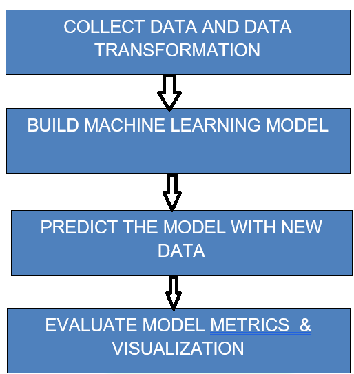

# LOAN_DEFAULT_PREDICTION
  
### PROJECT TITLE:
  LOAN_DEFAULT_PREDICTION using machine Learning Models.
           
### PROJECT DESCRIPTION: 
  The primary goal of this project is to develop a predictive model that can assess the risk of loan default for loan applicants. The objective is to help financial institutions make informed decisions about whether to approve or reject loan applications.

### WORKFLOW:
 
1. Data Preprocessing: 
#### This task involves cleaning, transforming, and preparing the loan applicant data. It includes handling missing values, encoding categorical variables, and scaling or normalizing numerical features.
2. Model Building: 
#### Develop a machine learning or statistical model capable of predicting the risk of loan default for each applicant. Common approaches include logistic regression, decision trees, random forests, gradient boosting, or support vector machines.
3. Model Evaluation: 
#### Assess the performance of the loan default risk prediction model using appropriate evaluation metrics. Common metrics include accuracy, precision, recall, F1-score, ROC curve, and AUC (Area Under the Curve).
4. Interpretability & Reporting:
#### Provide interpretability for the model's predictions and create reports that offer insights into the risk assessment process. Transparency and interpretability are crucial when dealing with financial decisions

 
 

 
 
 
Libraries to import :: scikit-learn, imbalanced-learn, xgboost, streamlit , pandas, plotly

CONCLUSION:
The goal of this project is to develop a predictive model that can assess the risk of loan default for loan applicants. The objective is to help financial institutions make informed decisions about whether to approve or reject loan applications.
